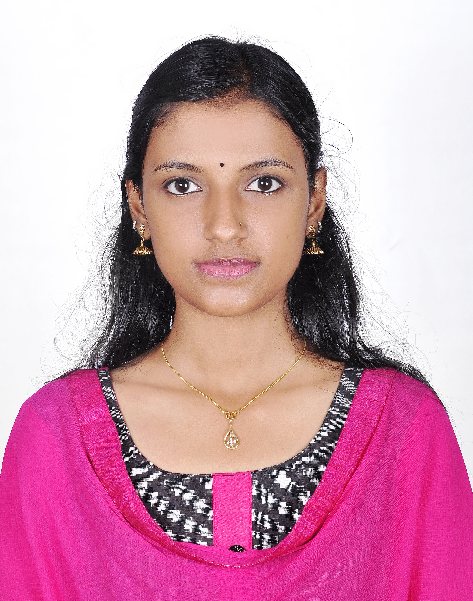

### SMRITHI E.S

**Contact No:**         8606842022
**E-mail:**             smrithies@gmail.com

> ##### CAREER OBJECTIVE
As a fresher, I want to put to use my creative skills, technologies that I am familiar with, innovative thoughts that will benefit the organization in the long run and also help me in building my professional career. I am looking for a position where I can use my knowledge to serve the organization and evolve continuously through learning. I am interested in programming, networking, machine learning and database programming.

> ##### ACADEMIC PERFORMANCE

|Educational qualification|Institution Name|Year of Passing|University|Aggregate to % or Marks|
|----------|----------|----------|----------|----------|
|B-Tech,Branch:-Information Technology(IT),Reg No:-EPAOEIT049|Govt.Engineering college Sreekrishnapuram Palakkad Dist|2018|Calicut|cgpa:-7.76|
|12th|L.S.N.G.H.S.S,Ottapalam,Palakkad Dist|2013|HSE|92.4|
|10th|L.S.N.G.H.S.S,Ottapalam,Palakkad Dist|2011|Kerala State Board|94|

> ##### COMPUTER SKILLS
C,JAVA,PYTHON,SQL,HTML,PHP,JAVASCRIPT

> ##### KEY SKILLS
- Excellent Presentation.
- Good communication skill.
- Motivational and leadership skills.
- Strong analytical, logical and mathematical skills.
- Decision making ability.
- Good oral and written Communication skill.
- Commitment towards work.
- Quick Learner, Confident, Punctual & Hard work.

> ##### ACHIEVEMENTS
- Won 5th and 11th rank in National Level Talent Search Examination at school level.
- Won 2 nd price for patriotic song in district level school youth festival.
- Selected as best actress for the role played in the drama at sub district level school youth festival.

> ##### EXTRACURRICULAR ACTIVITIES
- Singing
- Dancing
- Cooking
- Driving
- Making crafts and playing sudoku

> ##### PROJECTS OR TRAININGS UNDERTAKEN
**Projects**
  **BTech**
- ‘CONTENT BASED IMAGE RETRIEVAL USING DECISION TREE CLASSIFIER’ (done as Mini
Project).
- ‘SMART WASTE MANAGEMENT SYSTEM’.A waste bin which can provide attractive services in
return for cleaner surroundings(Main project). 
**Trainings**
- Network configuration-Accel It Academy,Palakkad

> ##### LANGUAGES KNOWN
English, Malayalam, Hindi, Tamil (Avg).

> ##### PERSONAL PROFILE
Date of Birth:   02/11/1995
Place of Birth:  Ottapalam, Palakkad
Nationality:     Indian
Marital Status:  Single
Gender:          Female
Contact Address: Karthika(H), Kizhur (PO)
                 Panamanna (VIA)
                 Palakkad (District)
                 PIN: 679501

> ##### DECLARATION
I do hereby declare that the particulars of information and facts stated herein above are true, correct and complete to the best of my knowledge and belief.

**PLACE:Ottapalam**                                                 **Yours sincerely,**
**DATE:**                                                           **SMRITHI E S**
